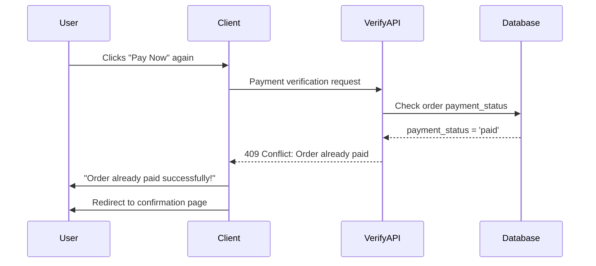
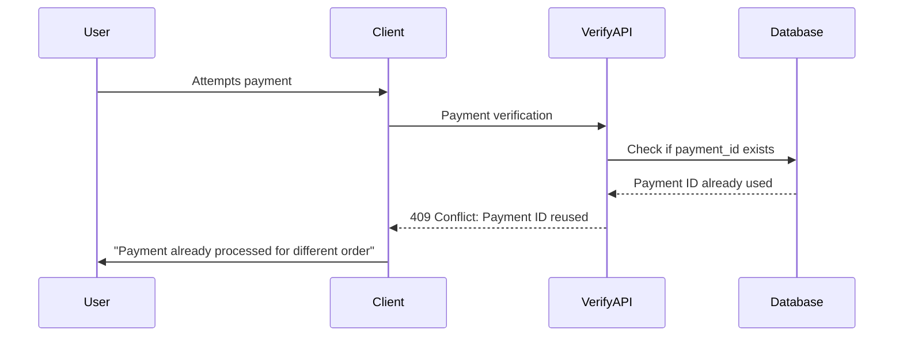
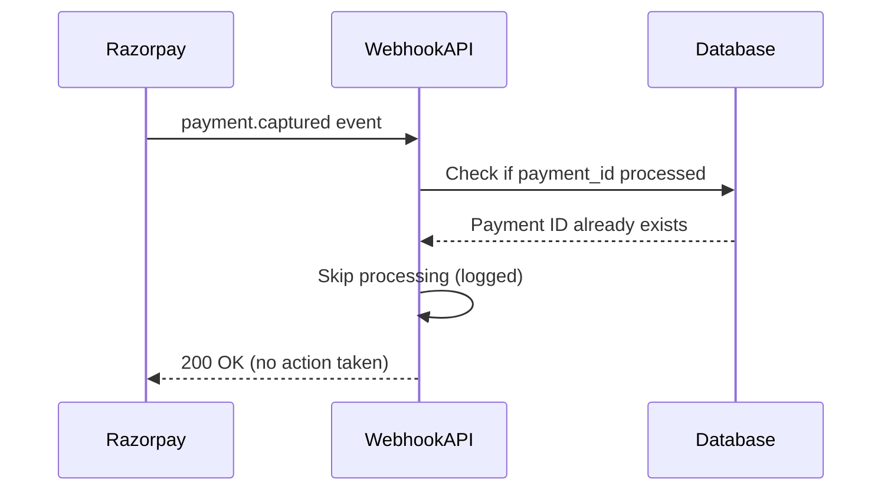

# 🔒 **DUPLICATE PAYMENT PROTECTION GUIDE**

## 🎯 **Problem Solved**

**Issue**: Users could potentially retry payments for orders that are already successfully paid, leading to:
- Multiple charges for the same order
- Duplicate payment processing
- Inconsistent order states
- Customer confusion and support issues

**Solution**: Multi-layered duplicate payment protection system

---

## 🛡️ **Protection Layers Implemented**

### **1. Database Level Protection**
- ✅ **Unique constraint** on `razorpay_payment_id` 
- ✅ **Database triggers** to prevent duplicate processing
- ✅ **Check constraints** for payment status consistency
- ✅ **Audit logging** for all payment changes

### **2. Server-Side Protection**
- ✅ **Payment verification function** checks order status first
- ✅ **Webhook handler** skips already processed payments
- ✅ **Payment ID validation** prevents reuse across orders

### **3. Client-Side Protection**
- ✅ **Graceful handling** of duplicate payment responses
- ✅ **User-friendly messages** for already paid orders
- ✅ **Automatic redirection** for successful duplicates

---

## 🔧 **How It Works**

### **Scenario 1: User Retries Payment on Already Paid Order**



### **Scenario 2: Same Payment ID Used for Different Order**



### **Scenario 3: Webhook Duplicate Event**



---

## 📝 **Implementation Details**

### **Database Protection**

```sql
-- Unique constraint prevents duplicate payment IDs
CREATE UNIQUE INDEX idx_orders_unique_razorpay_payment_id 
ON orders (razorpay_payment_id) 
WHERE razorpay_payment_id IS NOT NULL;

-- Trigger prevents processing paid orders
CREATE TRIGGER trigger_prevent_duplicate_payments
  BEFORE UPDATE ON orders
  FOR EACH ROW
  EXECUTE FUNCTION prevent_duplicate_payments();
```

### **Server-Side Checks**

```typescript
// In verify-razorpay-payment.ts
// Check if order is already paid
if (currentOrder.payment_status === 'paid') {
  return {
    statusCode: 409,
    body: JSON.stringify({
      error: 'Order has already been paid',
      duplicate_payment: true
    })
  };
}

// Check if payment ID already used
const existingPayment = await supabase
  .from('orders')
  .select('*')
  .eq('razorpay_payment_id', razorpay_payment_id);
```

### **Client-Side Handling**

```typescript
// In CheckoutPage.tsx
if (verificationResult.duplicate_payment) {
  toast.success('This order has already been paid successfully!');
  await handleSuccessfulOrder(...);
  return;
}
```

---

## 🚨 **Error Responses**

### **Duplicate Payment Detected**
```json
{
  "error": "Order has already been paid",
  "verified": false,
  "duplicate_payment": true,
  "existing_payment_id": "pay_xyz123",
  "order_number": "ORD-20250905-123456",
  "message": "This order has already been successfully paid. No additional payment is required."
}
```

### **Payment ID Reused**
```json
{
  "error": "Payment ID has already been used for another order",
  "verified": false,
  "duplicate_payment_id": true,
  "existing_order": "ORD-20250905-789012",
  "message": "This payment has already been processed for a different order."
}
```

---

## 📊 **Monitoring & Audit**

### **Payment Audit Log**
```sql
SELECT 
  order_id,
  old_payment_status,
  new_payment_status,
  old_payment_id,
  new_payment_id,
  changed_at,
  change_reason
FROM payment_audit_log
ORDER BY changed_at DESC;
```

### **Payment Status Summary**
```sql
SELECT * FROM payment_status_summary;
-- Shows counts and totals by payment status
```

### **Duplicate Detection Query**
```sql
SELECT 
  razorpay_payment_id,
  COUNT(*) as order_count,
  array_agg(order_number) as affected_orders
FROM orders
WHERE razorpay_payment_id IS NOT NULL
GROUP BY razorpay_payment_id
HAVING COUNT(*) > 1;
```

---

## 🔍 **Testing Scenarios**

### **Test 1: Retry Payment on Paid Order**
1. Complete a successful payment
2. Navigate back to checkout
3. Attempt payment again
4. **Expected**: "Order already paid" message + redirect

### **Test 2: Webhook Duplicate Event**
1. Trigger payment.captured webhook
2. Manually trigger same webhook again
3. **Expected**: Second event ignored (logged)

### **Test 3: Database Constraint**
1. Try to insert order with existing payment ID
2. **Expected**: Database constraint violation

---

## 🛠️ **Setup Instructions**

### **1. Apply Database Protection**
```bash
node add-duplicate-payment-protection.mjs
```

### **2. Deploy Updated Functions**
- Verify updated `verify-razorpay-payment.ts`
- Verify updated `razorpay-webhook.ts` 
- Verify updated `CheckoutPage.tsx`

### **3. Test Protection**
```bash
# Test with actual payment scenarios
npm run test:payment-protection
```

---

## ✅ **Verification Checklist**

- [ ] Database unique constraint created
- [ ] Duplicate prevention triggers active
- [ ] Server functions check order status
- [ ] Webhook handlers skip duplicates
- [ ] Client shows appropriate messages
- [ ] Audit logging functional
- [ ] Test scenarios pass

---

## 🎉 **Benefits**

### **For Customers**:
- ✅ No accidental double charges
- ✅ Clear messaging about payment status
- ✅ Seamless experience for retries

### **For Business**:
- ✅ Reduced payment disputes
- ✅ Fewer support tickets
- ✅ Data integrity maintained
- ✅ Complete audit trail

### **For Developers**:
- ✅ Comprehensive logging
- ✅ Easy monitoring
- ✅ Robust error handling
- ✅ Multiple protection layers

**🔒 Your payment system is now protected against duplicate payments at every level!**
